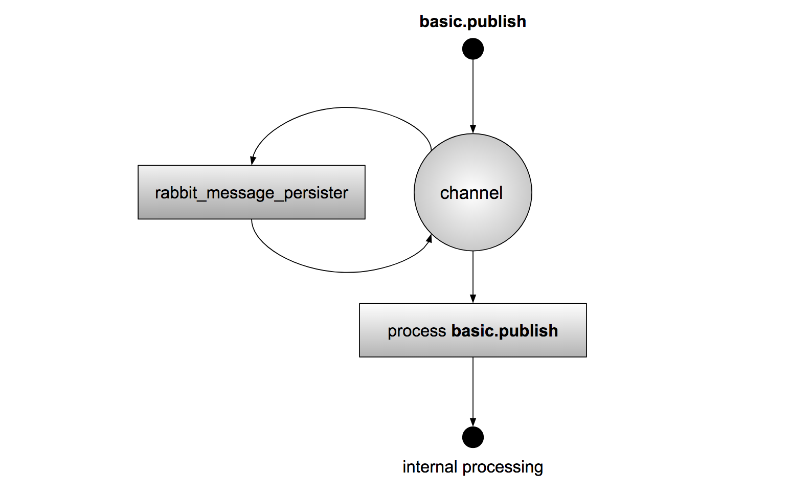

# RabbitMQ Message Persister

[](https://travis-ci.org/Ayanda-D/rabbitmq-message-persister)

This plugin persists or non-persists messages by filling the `delivery_mode` property of a
message as it enters RabbitMQ with the AMQP 0-9-1 protocol defined setting of
`2` or `1`, as configured `delivery_mode` value, regardless of the what value was
set/defined by the publishing client application. If enabled, it allows all RabbitMQ
ingress messages to be marked as persistent or transient on publish entry.

**NOTE:** The plugin assumes queues to which messages are destined to were
declared as **durable**, along with **durable exchanges** if **full message**
persistence is the desired outcome.

## Supported RabbitMQ Versions

This plugin targets RabbitMQ 3.6.0 and later versions.

## Operation

**Fig 1** illustrates the overview operation of the `rabbitmq-message-persister`
plugin when in use within an active RabbitMQ instance.

<p style="text-align:center"></p>
<p style="text-align:center"><b>Fig 1: RabbitMQ Message Persister Overview</b>
</p>

On reception of the `basic.publish` AMQP primitive, the `rabbitmq-message-persister`
channel interceptor is executed, applying the necessary/specific message persisting
primitives to the published content, prior handing it forward for further internal
processing. Message persisting primitives are always applied regardless of the previously
set message persisting fields in the inbound message.

## Limitations

This plugin cannot be used together with the following plugins:

- [rabbitmq-message-timestamp](https://github.com/rabbitmq/rabbitmq-message-timestamp)
- [rabbitmq-routing-node-stamp](https://github.com/rabbitmq/rabbitmq-routing-node-stamp)

as they override the same AMQP primitive.

## Installation

To create a package, execute `make dist` and find the `.ez` package file in the
`plugins` directory. Refer to the standard [RabbitMQ Plugin Installation Guide](http://www.rabbitmq.com/installing-plugins.html) for more details on
installing plugins that do not ship with RabbitMQ by default.

## Testing

Clone and execute `make tests` to test the plugin. View test results from the
generated HTML files.

## Usage

Enable the plugin with the following command:

```bash
rabbitmq-plugins enable rabbitmq_message_persister
```

## LICENSE

(c) Erlang Solutions Ltd. 2017-2018

https://www.erlang-solutions.com/
